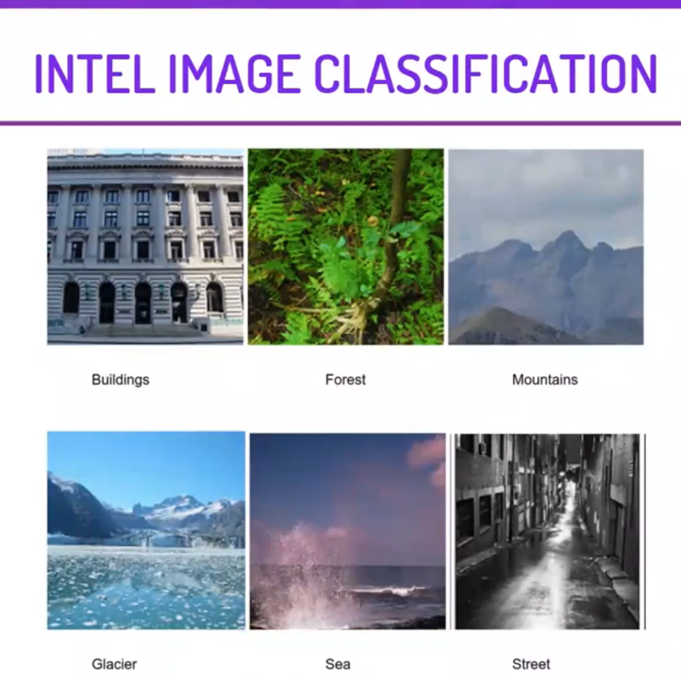

  
 

<i>
  <h2> <i> Intel Image Classification </i> </h2>

<i> IN THIS PROJECT. WE WILL BE WORKING ON INTEL IMAGES I.E. IMAGES OF BUILDINGS, FOREST. STREET, ETC. WE WILL BUILD A CONVOLUTIONAL NEURAL NETWORK AND TRAIN IT ON THESE IMAGES. THIS IS A MULTI-CLASS CLASSIFICATION PROBLEM AND WE WILL USE KERAS.

 
 

 

  <h2> The Steps to solve the problem </h2>

1. MOUNTING GOOGLE DRIVE ON COLLAB NOTEBOOK.  
2. VISUALIZING THE IMAGES THAT WE WILL BE WORKING ON.  
3. ANALYZING THE DIMESNIONS TO VERIFY IF ALL IMAGES HAVE SAME DIMENSIONS.  
4. CONVERTING THE IMAGES INTO A NUMPY ARRAY AND NORMALIZE THEM.  
5. CHECKING CLASS IMBALANCE.  
6. SPLITTING THE DATA AND PERFORMING ONE-HOT ENCODING.  
7. CREATING THE MODEL ARCHITECTURE, COMPILING THE MODEL AND THEN FITTING IT.  
8. PLOTTING THE ACCURACY AND LOSS AGAINST EACH EPOCH.  
9. PREPROCESSING THE TEST DATA AND MAKE PREDICTIONS ON IT.  
10. VISUALIZING THE ORIGINAL AND PREDICTED LABELS FOR THE TEST IMAGES. 

  
  

<i>THIS PROJECT CAN BE USED FOR EDUCATIONAL PURPOSES TO GET A BETTER UNDERSTANDING OF HOW TO CREATE NETWORK ARCHITECTURE FOR A CNN MODEL. YOU CAN FURTHER HYPERPARAMETER TUNE THIS MODEL TO REACH HIGHER ACCURACY.

THIS PROJECT HAS A VAST SCOPE, IT CAN BE USED TO CLASSIFY SATELLITE IMAGES, DRONE IMAGES, GOOGLE IMAGES INTO DIFFERENT CLASSES LIKE SEA, MOUNTAIN, ETC. 

     
  
  <h2> <i>Flask Web App  </i> </h2>

<i>SThis is the second part where we build the web application using the framework Flask We mount the model we build in the previous part on the Flask project

     
  
  
  <h1> Screenshots </h1>
  <h2> Input Screen </h2>
 

  
    
  
<h2> Output Screen </h2> 

   
    

### Give It a Star if you liked the project 
